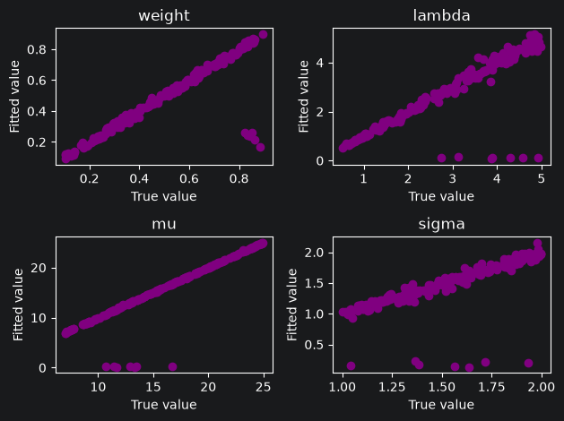
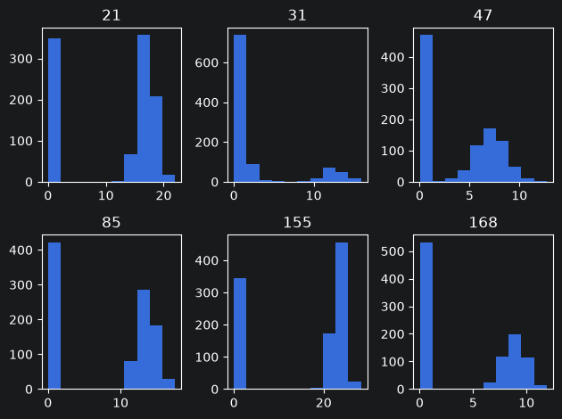
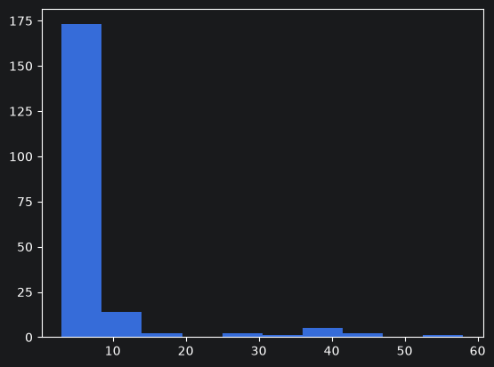

```python
import numpy as np
import pandas as pd
from densmix.generator import Generator
from densmix.models import Models
import matplotlib.pyplot as plt
```

# densmix

<!-- badges: start -->
<!-- badges: end -->

Here we show several examples for densmix library related to exponential - normal density separation.

## Generate data and fit mixtures

We start by generating many datasets with set parameters and then using the library to decompose it. In this case we choose $lambda$, $mu$ and $sigma$ in a way that densities are well separated.


```python
np.random.seed(123)

n_sim = 200

exp_norm_param_list = [
    {
        "weight": np.random.uniform(0.1, 0.9),
        "lambda": np.random.uniform(0.5, 5),
        "mu": np.random.uniform(7, 25),
        "sigma": np.random.uniform(1, 2)
    }
    for _ in range(n_sim)
]

exp_norm_gen_datasets_list = [
    Generator(
        size=1000,
        parameters=parameters
    ).gen_exp_norm()
    for parameters in exp_norm_param_list
]

exp_norm_fits_list = [
    Models(data).fit_exp_norm()
    for data in exp_norm_gen_datasets_list
]

exp_norm_true_param_df = pd.DataFrame(
    exp_norm_param_list
)

exp_norm_fit_param_df = pd.DataFrame([
    fit["parameters"]
    for fit in exp_norm_fits_list
])
```

## Scatterplots

Next, we compare parameters by looking at scatterplots:


```python
column_names = ["weight", "lambda", "mu", "sigma"]

fig, axes = plt.subplots(2, 2)
axes = axes.flatten()

for ax, column_name in zip(axes, column_names):
    ax.scatter(
        exp_norm_true_param_df[column_name],
        exp_norm_fit_param_df[column_name],
        color="purple"
    )

    ax.set_xlabel("True value")
    ax.set_ylabel("Fitted value")
    ax.set_title(column_name)

plt.tight_layout()
plt.show()
```


    

    


We see that in most of the cases apart from 6 points, algorithm worked well and parameters are similar to one another.

Next, we check 6 suspicious points to discover that it happens when EM thinks that density close to zero is normal and provides a wrong fit:


```python
unusual = exp_norm_fit_param_df[
    exp_norm_fit_param_df["mu"] < 1
]
unusual
```


<div>
<style scoped>
    .dataframe tbody tr th:only-of-type {
        vertical-align: middle;
    }

    .dataframe tbody tr th {
        vertical-align: top;
    }

    .dataframe thead th {
        text-align: right;
    }
</style>
<table border="1" class="dataframe">
  <thead>
    <tr style="text-align: right;">
      <th></th>
      <th>weight</th>
      <th>lambda</th>
      <th>mu</th>
      <th>sigma</th>
    </tr>
  </thead>
  <tbody>
    <tr>
      <th>21</th>
      <td>0.242316</td>
      <td>0.103925</td>
      <td>0.179179</td>
      <td>0.153981</td>
    </tr>
    <tr>
      <th>31</th>
      <td>0.260311</td>
      <td>0.115192</td>
      <td>0.166971</td>
      <td>0.140107</td>
    </tr>
    <tr>
      <th>47</th>
      <td>0.235282</td>
      <td>0.137015</td>
      <td>0.265810</td>
      <td>0.222191</td>
    </tr>
    <tr>
      <th>85</th>
      <td>0.258257</td>
      <td>0.121741</td>
      <td>0.164818</td>
      <td>0.136103</td>
    </tr>
    <tr>
      <th>155</th>
      <td>0.165656</td>
      <td>0.079767</td>
      <td>0.227650</td>
      <td>0.198860</td>
    </tr>
    <tr>
      <th>168</th>
      <td>0.211641</td>
      <td>0.118387</td>
      <td>0.280759</td>
      <td>0.232942</td>
    </tr>
    <tr>
      <th>187</th>
      <td>0.244485</td>
      <td>0.129148</td>
      <td>0.206888</td>
      <td>0.171339</td>
    </tr>
  </tbody>
</table>
</div>


```python
import matplotlib.pyplot as plt

dataset_numbers = unusual.index

fig, axes = plt.subplots(2, 3)
axes = axes.flatten()

for ax, dataset_number in zip(axes, dataset_numbers):
    ax.hist(
        exp_norm_gen_datasets_list[dataset_number - 1]
    )
    ax.set_title(str(dataset_number))

plt.tight_layout()
plt.show()
```


    

    


We also check how in many iterations algorithm converges:


```python
iteration_counts = np.array([
    fit["iterations"]
    for fit in exp_norm_fits_list
])

plt.hist(iteration_counts)
plt.show()

proportion_below_10 = np.mean(iteration_counts < 10)

print(proportion_below_10)
```


    

    


    0.895
    

to see that it usually converges fast (around 90% of cases in under 10 iterations).


```python

```
