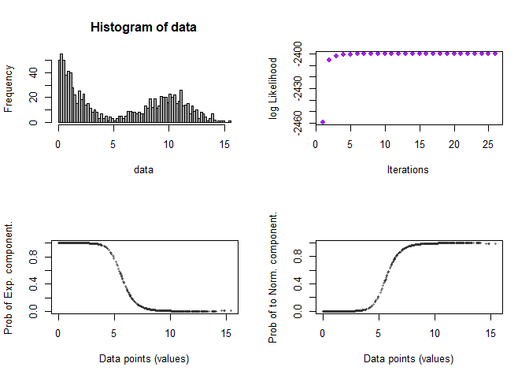

<!-- README.md is generated from README.Rmd. Please edit that file -->

# densmix

<!-- badges: start -->

<!-- badges: end -->

The goal of densmix is to fit density mixture models to data.

Two mixture models are supported:

- One dimensional exponential - normal density.
- Mixture of multinomials.

## Installation

You can install the development version of densmix from
[GitHub](https://github.com/) with:

``` r
# install.packages("pak")
pak::pak("agehsbargswork-blip/data-science")
```

## Example

This is a basic example which shows you how to solve a common problem:

``` r
library(densmix)

params <- list(
  weight=0.5,
  lambda=0.6,
  mu=10,
  sigma=2
)

data <- gen_exp_normal(size=1000,params)
emfit <- fit_exp_normal(data)
plot(emfit)
```


