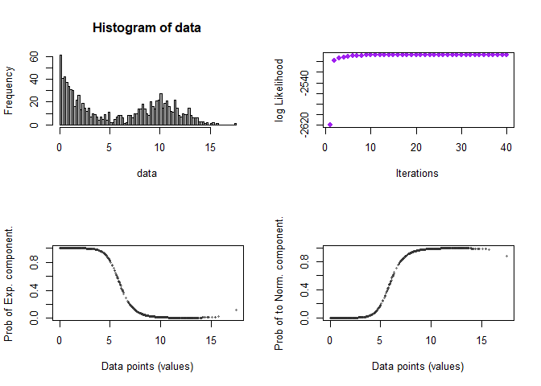
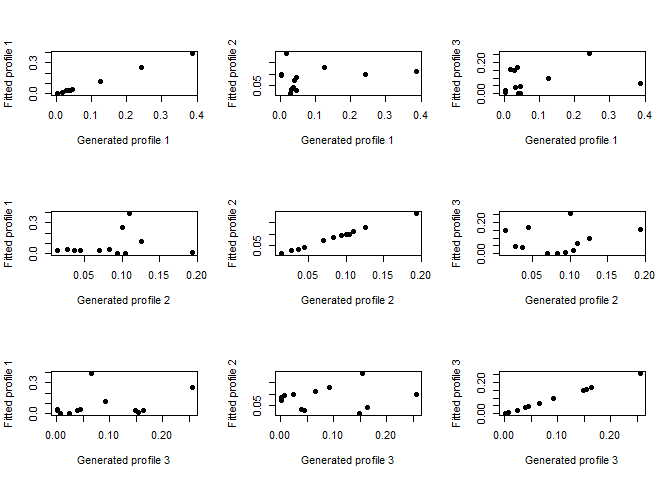
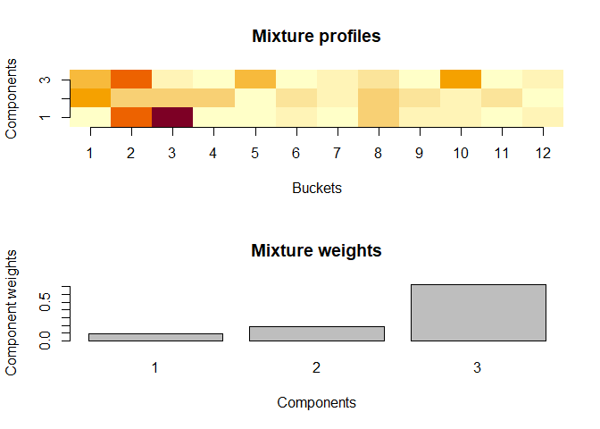

<!-- README.md is generated from README.Rmd. Please edit that file -->

# densmix

<!-- badges: start -->

<!-- badges: end -->

The goal of densmix is to fit density mixture models to data.

Two mixture models are supported:

- One dimensional exponential - normal density.
- Mixture of multinomials.

## Installation

You can install the development version of densmix from
[GitHub](https://github.com/) with:

``` r
# install.packages("pak")
pak::pkg_install(
  "densmix=github::agehsbargswork-blip/data-science/R/densmix"
)
```

## Example: exp-normal density

Here we generate exponential-normal data and check if algorithm
reconstructs it:

``` r
library(densmix)

params <- list(
  weight=0.5,
  lambda=0.6,
  mu=10,
  sigma=2
)

data <- gen_exp_normal(size=1000,params)
emfit <- fit_exp_normal(data)
plot(emfit)
```



## Example: multinomial density

Here we generate multinomial data with three densities and check if
algorithm reconstructs it. We compare all pairs of densities as order of
reconstruction is arbitrary.

``` r
library(densmix)
set.seed(123)
gendata <- gen_em_mn(size = 1000,
                     params = list("n_components" = 3,
                                   "n_buckets" = 12,
                                   "dirichlet" = rep(1,12),
                                   "component_weights" = c(0.1,0.2,0.7),
                                   "n_actions_per_bucket" = list(
                                     "max_actions" = 100,
                                     "prob_action" = 0.5
                                   )
                     )
      )


fitdata <- fit_multinomial(gendata$data, control = list(verbose = TRUE))
#> Iter: 1 {"weights":[0.3333,0.3333,0.3333],"profiles_delta":0.0868,"weights_delta":0.8813}Iter: 2 {"weights":[0.0695,0.1565,0.774],"profiles_delta":0.0771,"weights_delta":0.2064}Iter: 3 {"weights":[0.0946,0.186,0.7194],"profiles_delta":0.0075,"weights_delta":0.0182}Iter: 4 {"weights":[0.09,0.186,0.724],"profiles_delta":3.6292e-08,"weights_delta":1.1348e-07}

par(mfrow=c(3,3))
for(i in 1:3){
  for(j in 1:3){
    plot(gendata$mixture_profiles[i,]
         ,fitdata$mixture_profiles[j,]
         ,pch=19
         ,xlab=paste("Generated profile ",i,sep="")
         ,ylab=paste("Fitted profile ",j,sep="")
         )
  }
}
```



``` r

plot(fitdata)
```


