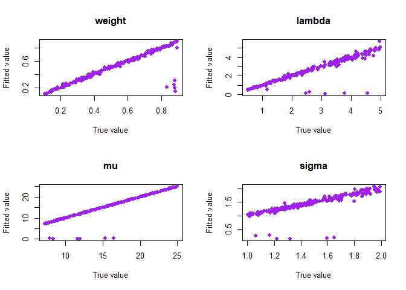
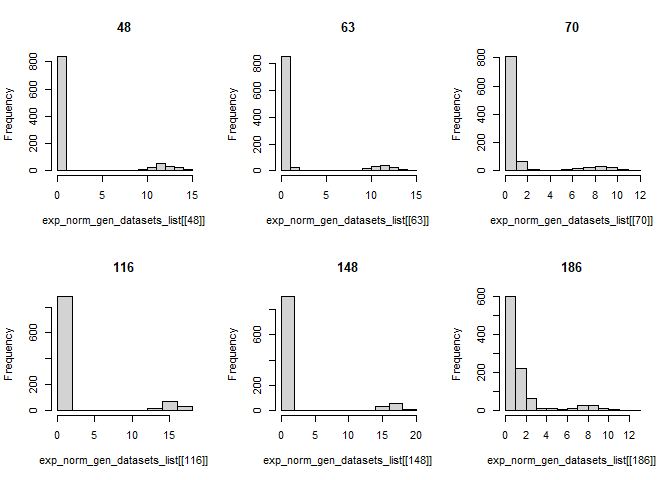
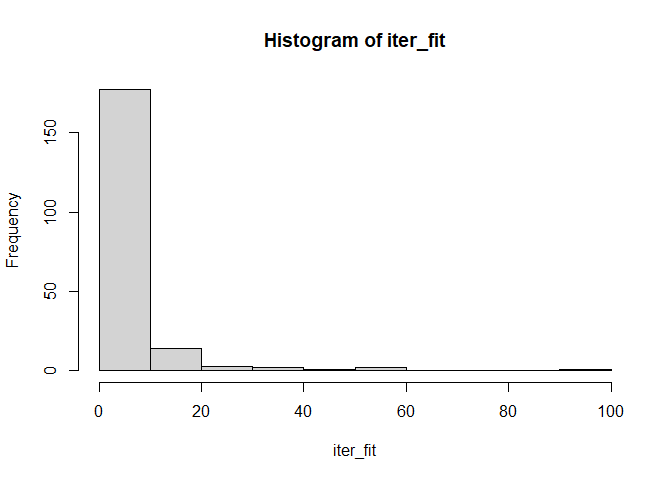
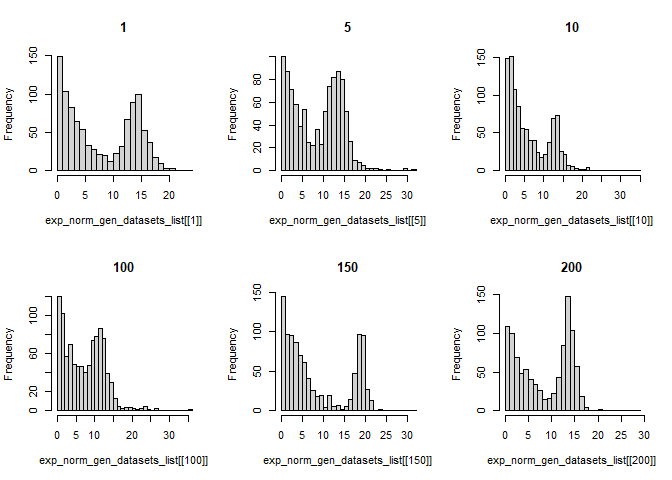
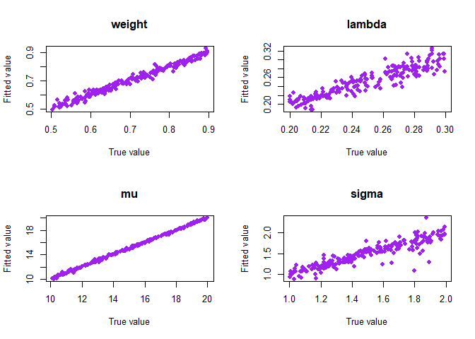
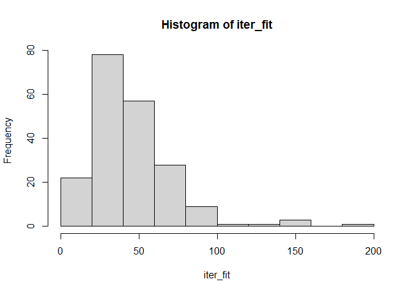

<!-- README.md is generated from README.Rmd. Please edit that file -->

# densmix

<!-- badges: start -->

<!-- badges: end -->

Here we show several examples for densmix library related to
exponential - normal density separation.

## Generate data and fit mixtures

We start by generating many datasets with set parameters and then using
the library to decompose it. In this case we choose $lambda$, $mu$ and
$sigma$ in a way that densities are well separated.

``` r
library(densmix)

set.seed(123)
n_sim <- 200
exp_norm_param_list <-
  lapply(
    seq_len(n_sim),
    gen_exp_norm_params <- function(j){
      list(
        weight=runif(1,0.1,0.9),
        lambda=runif(1,0.5,5),
        mu=runif(1,7,25),
        sigma=runif(1,1,2)
      )
    }
  )

exp_norm_gen_datasets_list <-
  lapply(
    exp_norm_param_list,
    gexpnorm_list <- function(l){
      gen_exp_normal(size=1000,parameters=l)
    }
  )

exp_norm_fits_list <-
  lapply(
    exp_norm_gen_datasets_list,
    gexpnorm_list <- function(d){
      fit_exp_normal(d)
    }
  )

exp_norm_true_param_df <- as.data.frame(
  do.call(rbind, exp_norm_param_list)
)

exp_norm_fit_param_df <-
  as.data.frame(
    do.call(
      rbind,
      lapply(
        exp_norm_fits_list,
        get_param <- function(l){
          l$parameters
        }
      )
    )
  )
```

## Scatterplots

Next, we compare parameters by looking at scatterplots:

``` r
par(mfrow=c(2,2))
cnames <- c("weight", "lambda", "mu", "sigma")
for(cname in cnames){
  plot(
    exp_norm_true_param_df[[cname]],
    exp_norm_fit_param_df[[cname]],
    xlab = "True value",
    ylab = "Fitted value",
    main = cname,
    pch = 19,
    col = "purple"
  )
}
```



We see that in most of the cases apart from 6 points, algorithm worked
well and parameters are similar to one another.

Next, we check 6 suspicious points to discover that it happens when EM
thinks that density close to zero is normal and provides a wrong fit:

``` r
exp_norm_fit_param_df[exp_norm_fit_param_df$mu<1,]
#>        weight     lambda        mu     sigma
#> 48  0.2054669 0.10862720 0.1808687 0.1562054
#> 63  0.2422699 0.15886051 0.1862321 0.1507604
#> 70  0.3070614 0.26784276 0.2487819 0.1952150
#> 116 0.1962545 0.10541822 0.3214371 0.2712175
#> 148 0.1436072 0.08626418 0.2895408 0.2503083
#> 186 0.7979113 0.53532061 0.2975078 0.1648075

par(mfrow=c(2,3))
hist(exp_norm_gen_datasets_list[[48]],main=48)
hist(exp_norm_gen_datasets_list[[63]],main=63)
hist(exp_norm_gen_datasets_list[[70]],main=70)
hist(exp_norm_gen_datasets_list[[116]],main=116)
hist(exp_norm_gen_datasets_list[[148]],main=148)
hist(exp_norm_gen_datasets_list[[186]],main=186)
```



We also check how in many iterations algorithm converges:

``` r
iter_fit <-
  do.call(
      rbind,
      lapply(
          exp_norm_fits_list,
          get_param <- function(l){
              l$iterations
          }
      )
  )
hist(iter_fit)
```



``` r
sum(iter_fit<10)/length(iter_fit)
#> [1] 0.86
```

to see that it usually converges fast (around 90% of cases in under 10
iterations).

## :ess well separated data

Next we generate data that is less well separated

``` r
set.seed(123)
n_sim <- 200
exp_norm_param_list <-
  lapply(
    seq_len(n_sim),
    gen_exp_norm_params <- function(j){
      list(
        weight=runif(1,0.5,0.9),
        lambda=runif(1,0.2,0.3),
        mu=runif(1,10,20),
        sigma=runif(1,1,2)
      )
    }
  )

exp_norm_gen_datasets_list <-
  lapply(
    exp_norm_param_list,
    gexpnorm_list <- function(l){
      gen_exp_normal(size=1000,parameters=l)
    }
  )

exp_norm_fits_list <-
  lapply(
    exp_norm_gen_datasets_list,
    gexpnorm_list <- function(d){
      fit_exp_normal(d)
    }
  )

exp_norm_true_param_df <- as.data.frame(
  do.call(rbind, exp_norm_param_list)
)

exp_norm_fit_param_df <-
  as.data.frame(
    do.call(
      rbind,
      lapply(
        exp_norm_fits_list,
        get_param <- function(l){
          l$parameters
        }
      )
    )
  )
```

Examples of raw data:

``` r
par(mfrow=c(2,3))
hist(exp_norm_gen_datasets_list[[1]],main=1,breaks=30)
hist(exp_norm_gen_datasets_list[[5]],main=5,breaks=30)
hist(exp_norm_gen_datasets_list[[10]],main=10,breaks=30)
hist(exp_norm_gen_datasets_list[[100]],main=100,breaks=30)
hist(exp_norm_gen_datasets_list[[150]],main=150,breaks=30)
hist(exp_norm_gen_datasets_list[[200]],main=200,breaks=30)
```



We can still however see that it converges well:

``` r
par(mfrow=c(2,2))
cnames <- c("weight", "lambda", "mu", "sigma")
for(cname in cnames){
  plot(
    exp_norm_true_param_df[[cname]],
    exp_norm_fit_param_df[[cname]],
    xlab = "True value",
    ylab = "Fitted value",
    main = cname,
    pch = 19,
    col = "purple"
  )
}
```



Though much slower:

``` r
iter_fit <-
  do.call(
    rbind,
    lapply(
      exp_norm_fits_list,
      get_param <- function(l){
        l$iterations
      }
    )
  )
hist(iter_fit)
```



``` r
quantile(iter_fit)
#>    0%   25%   50%   75%  100% 
#>  13.0  27.0  40.5  56.0 185.0
```
