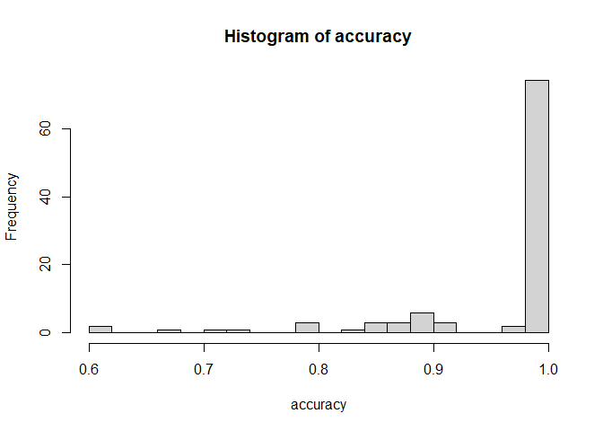
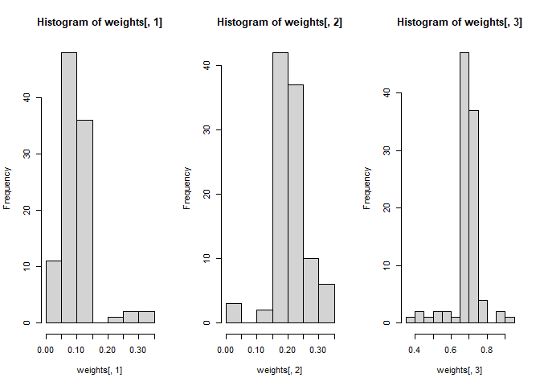
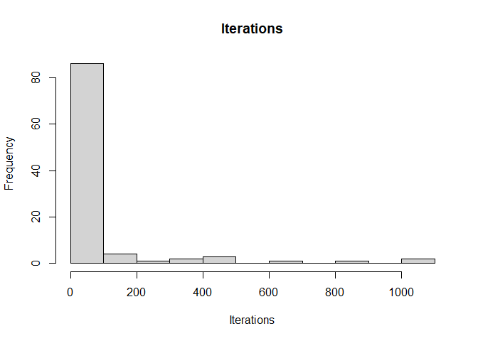

<!-- README.md is generated from README.Rmd. Please edit that file -->

# densmix

<!-- badges: start -->

<!-- badges: end -->

Here we show several examples for densmix library related to multinomial
density separation.

## Generate data and fit mixtures

We start by generating many datasets with fixed parameters and then
using the library to decompose it.

We fix number of components to be equal to $3$ and weights of components
to be equal to $c(0.1,0.2,0.7)$.

We generate component profiles from uniform Dirichlet distribution and
then try to find them.

Number of buckets *n_buckets* mean that dataset will have 12 columns.

Parameters *max_actions* and *prob_action* control how we fill in such
dataset:

Each multinomial component is described

- Vector of probabilities we take from Dirichlet
- “Total number of objects” that “distributed” across 12 buckets. That
  “total number of objects” is generated once per component as one value
  from binomial distribution with (a) number of trials equal to
  *max_actions* and (b) probability of success equal to *prob_action*.

You can think about dataset generatio as two step process:

- Step 1. Define Multinomial: Generate vector of probabilities from
  uniform Dirichlet, generate total number of observations from
  binomial.
- Step 2. Given fully defined multinomial component, generate $w[k]*N$
  samples, where $w[k]$ is the weight of $k$th component and $N$ is
  required sample size (defined by $size$).

``` r
library(densmix)

set.seed(1234)
n_sim <- 100
em_nm_gen_list <-
  lapply(
    seq_len(n_sim),
    getnm <- function(j){
      gen_em_mn(size = 1000,
                params = list("n_components" = 3,
                              "n_buckets" = 12,
                              "dirichlet" = rep(1,12),
                              "component_weights" = c(0.1,0.2,0.7),
                              "n_actions_per_bucket" = list(
                                "max_actions" = 100,
                                "prob_action" = 0.5
                              )
                )
      )
    }
  )


em_nm_fit_list <-
  lapply(
    seq_len(n_sim),
    fitem <- function(j){
      fit_multinomial(em_nm_gen_list[[j]]$data)
    })
```

## Label comparison

Next, we compare labels:

- Generator gives us true lables
- We extract predicted labels as “argmax” from table with posterior
  Bayesian probabilities (that table is part of the EM-algorithm).

Finally, as EM returns arbitrary labels, we use Hungarian algoritm to
find “best” permutation of labels in the fit to match true labels.

``` r
em_mn_fit_labels_list <- lapply(
  em_nm_fit_list,
  getlabels <- function(l){
    apply(l$bayes_probs,1,which.max)
  })

em_mn_true_labels_list <- lapply(
  em_nm_gen_list,
  getlabels <- function(l){
    l$component_labels
  })


library(clue)
em_mn_acc_weights_list <-
  lapply(
    seq_len(n_sim),
    getacc <- function(j){
      confusion_table <- table(
        em_mn_true_labels_list[[j]],
        em_mn_fit_labels_list[[j]]
        )
      permut <- clue::solve_LSAP(confusion_table
                                 , maximum = TRUE)
      list(
        "accuracy" = sum(diag(confusion_table[,permut])) / sum(confusion_table),
        "weights" = em_nm_fit_list[[j]]$weights[permut]
      )
    })

accuracy <-
  unlist(
    lapply(
      em_mn_acc_weights_list,
      z <- function(l){
        l$accuracy
      })
  )
```

Finally, we compare labels by checking accuracy of the fit.

Accuracy is quite high (in most of the cases it is 100%).

Reasons are:

- We have only 3 components, which is easy to decompose
- Average total number of observations per row in the original dataset
  is 50 (controlled by max_actions\*prob_action = 50

``` r
par(mfrow=c(1,1))
hist(accuracy,breaks=20)
```



We also check weights of the components that were fixed at
$c(0.1,0.2,0.7)$:

``` r
weights <-
  do.call(
    rbind,
    lapply(
      em_mn_acc_weights_list,
      z <- function(l){
        l$weights
      })
  )
par(mfrow=c(1,3))
hist(weights[,1])
hist(weights[,2])
hist(weights[,3])
```



We also check how in many iterations algorithm converges:

to see that it usually converges fast (around 75% of cases in under 20
iterations).

``` r
iter_vec <-
  unlist(
    lapply(
      em_nm_fit_list,
      getlabels <- function(l){
        l$iterations
      })
  )

hist(
  iter_vec,
  main = "Iterations",
  xlab =  "Iterations"
)
```



``` r
quantile(iter_vec)
#>     0%    25%    50%    75%   100% 
#>    3.0    5.0    7.0   20.5 1001.0
```
